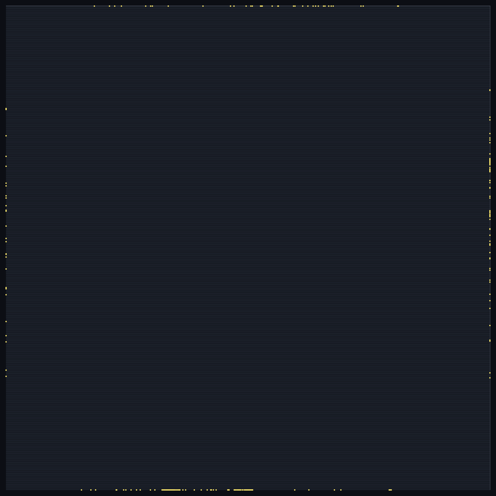
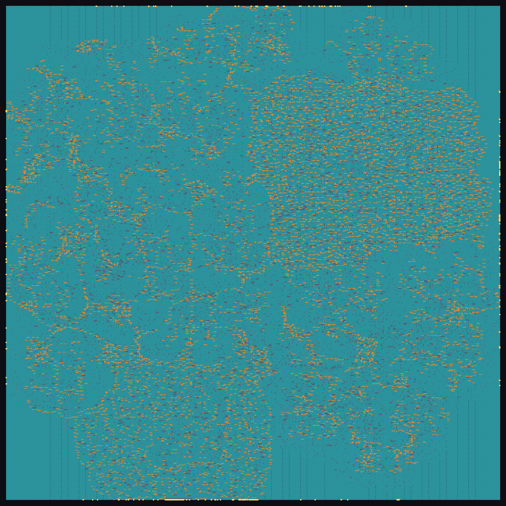
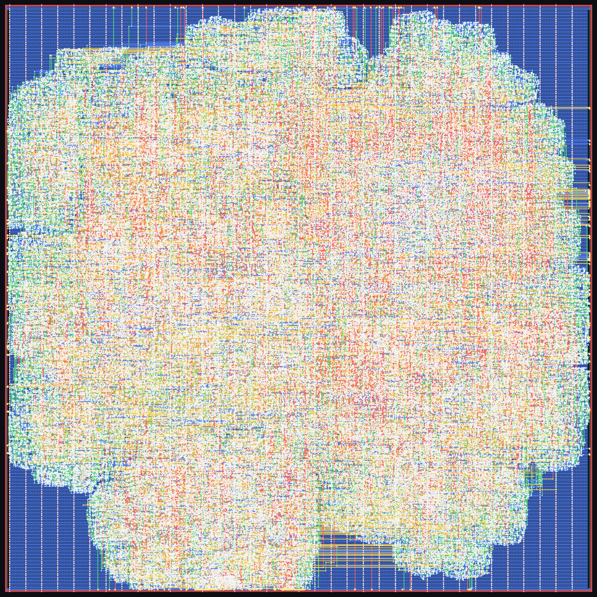
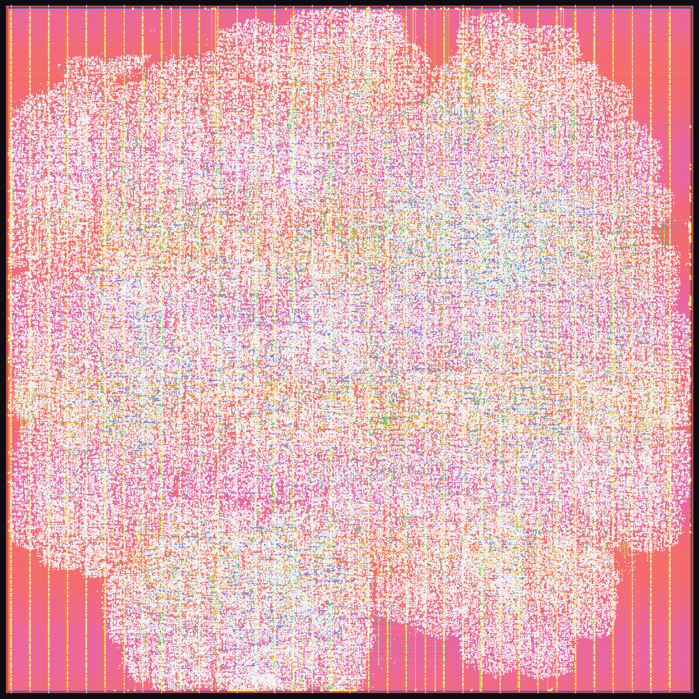

# 8x8 INT8 systolic-array accelerator — RTL to GDSII on SKY130 with IndepthSilicon

**`accel_top` taken from RTL to a signed-off GDSII layout by the IndepthSilicon flow, in one run, at a 15 ns clock (66.7 MHz) on SkyWater SKY130 (`sky130_fd_sc_hd`). Every sign-off number below was re-measured on the shipped layout by independent, widely used open-source sign-off tools, and every one of them is at zero.**

An 8x8 INT8 systolic array (64 multiply-accumulate processing elements, output-stationary INT32 accumulation) with a memory-mapped register interface and a skewed streaming controller.

## Result at a glance

| Check (on the shipped layout) | IndepthSilicon | Independent tool |
|---|---:|---:|
| Design-rule check | **0** violations | **0** — SKY130 foundry rule deck |
| Layout vs schematic | **match** (84,579 / 84,579 nets) | **match** — 85,418 devices |
| Antenna | **0** | **0** nets, **0** pins |
| Setup timing, 3 corners | **met** (worst 0.000 ns) | **met** (worst 0.000 ns) |
| Hold timing, 3 corners | **met** (worst 0.050 ns) | **met** (worst 0.047 ns) |
| Max slew / capacitance / fanout | **0 / 0 / 0** | **0 / 0 / 0** |
| Shipped netlist equal to RTL | **proven** (6,857 / 6,857 compare points) | **proven** (17,535 compare points) |

## Layout

| | |
|---|---|
|  |  |
| **Floorplan** — die, standard-cell rows, I/O pins | **Placement** — placed cells after clock-tree build |
|  |  |
| **Routing** — 5 metal layers, before fill | **Final layout** — the shipped GDSII, filler cells and metal fill included |

## Stage-by-stage comparison

Three columns, for the same RTL and the same 15 ns clock:

* **IndepthSilicon** — what the IndepthSilicon flow reports about its own result.
* **Independent tool** — the IndepthSilicon layout and netlist re-measured by an independent open-source sign-off tool (which tool is listed under *How the independent numbers were produced*).
* **Reference flow** — the same RTL taken through the open-source LibreLane 3.0.1 flow (OpenROAD-based), default configuration, same PDK and clock. It is a separate implementation of the same design, shown for scale.

| Stage | Metric | IndepthSilicon | Independent tool | Reference flow |
|---|---|---:|---:|---:|
| RTL read-in | gates / registers after elaboration | 202,160 / 6,823 | — | — |
| Synthesis | mapped cells | 62,190 | — | 69,381 |
| Synthesis | cell area (µm²) | 690,642 | — | 792,603 |
| Synthesis | registers | 6,823 | — | 6,176 |
| Synthesis check | netlist equal to RTL (compare points) | 6,857 / 6,857 proven | — | not checked |
| Test insertion | scan chains / registers on chain | 69 / 6,823 | — | not inserted |
| Test insertion | stuck-at fault coverage (test coverage) | 99.56 % (99.87 %), 1,598 patterns | — | — |
| Floorplan | die size (µm) | 1462.2 × 1462.2 | — | 1418.7 × 1429.4 |
| Floorplan | die area (µm²) | 2,138,029 | — | 2,027,920 |
| Clock tree | clock buffers | 890 | — | 1,222 |
| Routing | signal nets routed | 84,562 | — | 82,546 |
| Routing | routed signal wirelength (µm) ¹ | 4,289,651 | — | 3,247,761 |
| Routing | vias ¹ | 626,768 | — | 697,795 |
| Routing | antenna diodes inserted | 1,037 | — | 58,155 |
| Final netlist | logic cells (no fill, tap or diode) | 83,407 | — | 82,955 |
| Physical verification | DRC violations | **0** | **0** (foundry deck) | 0 |
| Physical verification | LVS | **match** | **match** (85,418 = 85,418 devices) | 0 errors |
| Physical verification | antenna violations | **0** | **0** nets / **0** pins | 0 |
| Physical verification | netlist ↔ layout connections missing / extra | — | **0 / 0** | — |
| Physical verification | undriven / multiply-driven nets | — | **0 / 0** | — |
| Timing — typical, 25 °C, 1.80 V | setup worst slack (ns) ² | **1.564** | **1.570** | 2.849 |
| Timing — slow, 100 °C, 1.60 V | setup worst slack (ns) ² | **0.000** | **0.000** | -4.461 |
| Timing — fast, −40 °C, 1.95 V | setup worst slack (ns) ² | **2.553** | **2.559** | 5.084 |
| Timing — typical, 25 °C, 1.80 V | hold worst slack (ns) | **0.239** | **0.233** | 0.303 |
| Timing — slow, 100 °C, 1.60 V | hold worst slack (ns) | **0.345** | **0.268** | -0.375 |
| Timing — fast, −40 °C, 1.95 V | hold worst slack (ns) | **0.050** | **0.047** | 0.107 |
| Timing | max slew / capacitance / fanout violations | **0 / 0 / 0** | **0 / 0 / 0** | 42,156 / 139 / 5,201 |
| Timing | clock-gate enable paths: gates / unconstrained / worst setup (ns) | — | 20 / 0 / 0.0 | — |
| Power | total, typical corner (mW) ³ | 65.209 | 65.722 | 41.316 |
| Power | worst IR drop VPWR / VGND (mV) ³ | 0.633 / 0.572 | 0.628 / 0.584 | 0.145 |
| Sign-off | shipped netlist equal to RTL | **proven** 6,857 / 6,857 | **proven** — 6,175 registers paired, 17,535 compare points | not checked |

¹ Measured from each flow's DEF the same way (signal nets only, power and ground excluded); the same script reproduces the reference flow's own reported wirelength to within 1 µm.

² IndepthSilicon's column is reported with level-sensitive latch pins timed at their opening edge, the convention the independent timer uses, so the two columns are directly comparable. The reference flow is at its nominal parasitic corner; across all of its nine corners its worst setup slack is -4.971 ns and its worst hold slack -0.638 ns.
  A setup slack of exactly 0.000 ns at the slow corner is a clock-gating latch borrowing time from its open phase: the path is met, not violated.

³ IndepthSilicon and the independent tool use the same deterministic activity (every data net 0.1 transitions per cycle, clock 2) and agree within a few percent. The reference flow's power uses its own activity setting and its IR drop is on its own power grid at its own power, so that column is shown for scale only, not as a like-for-like comparison.

### Reading the comparison

* **Synthesis.** IndepthSilicon maps this design to 10 % fewer cells than the reference flow (13 % less cell area).
* **Routing.** It routes 32 % more signal wire over 2 % more nets. Part of the difference is the 69 scan chains IndepthSilicon inserts for manufacturing test, which the reference flow does not; the dies also differ in size.
* **Timing.** At 15 ns the reference flow does not close timing (worst setup slack -4.971 ns and worst hold slack -0.638 ns across its corners) and leaves 42,156 slew, 139 capacitance and 5,201 fanout violations. IndepthSilicon meets setup and hold at all three corners with zero slew, capacitance and fanout violations, and the independent timer agrees.
* **Verification.** IndepthSilicon proves its shipped netlist equal to the RTL inside the flow, and an independent equivalence checker proves the same; the reference flow runs no equivalence check.

## How the independent numbers were produced

None of these tools is part of IndepthSilicon. Each one reads the shipped files (GDSII, DEF, Verilog netlist) directly.

| Check | Independent tool |
|---|---|
| Design rules | KLayout with the SKY130 foundry rule deck (`sky130A_mr.drc`) on the GDSII |
| Parasitics + static timing, 3 corners | OpenRCX extraction from the DEF, OpenSTA with the SKY130 Liberty corners |
| Antenna | OpenROAD antenna checker on the DEF |
| Layout vs schematic | Magic extraction + Netgen comparison, as the reference flow runs them |
| Power, IR drop | OpenSTA power report; OpenROAD PDNSim on the drawn power grid |
| Equivalence, shipped netlist vs RTL | Yosys elaborates the RTL on its own; ABC proves the two equal |

The independent tools' own reports are in [`reports/independent/`](reports/independent/).

## Repository layout

```
accel-top-gds2-flow/
├── rtl/accel_top_flat.v             design RTL
├── flow/run_flow.txt              the complete flow script (one run, RTL to GDSII)
├── netlist/accel_top_postpnr.v      shipped gate-level netlist
├── layout/accel_top.gds.gz          shipped GDSII (gzip)
├── layout/accel_top.def.gz          shipped DEF (gzip)
├── images/                        floorplan, placement, routing, final layout
└── reports/independent/           timing, DRC, LVS, antenna, power, equivalence reports
```

## The flow

One script, one run. The flow chooses the die from the cell area, places, builds the clock tree, routes, closes timing and sign-off, and writes the layout:

```
load_sky130
read_verilog rtl/accel_top_flat.v
set_clock_period 15
run_all 200 200
write_netlist accel_top_postpnr.v
write_def accel_top.def
write_gds accel_top.gds
write_image images/04_final_layout.png routing
exit
```

Stages, in order: RTL read-in and lint, logic synthesis and technology mapping to `sky130_fd_sc_hd`, equivalence check of the netlist against the RTL, scan insertion and test-pattern generation, floorplan and power grid, placement, clock-tree build, routing, timing and electrical repair, filler and metal fill, then physical verification (DRC, LVS, antenna), multi-corner timing sign-off on extracted parasitics, power and IR drop, and a final equivalence check of the shipped netlist against the RTL.

---

*Layout, netlist and reports produced by the IndepthSilicon flow. SKY130 is an open PDK. Clock 15 ns at every corner.*
